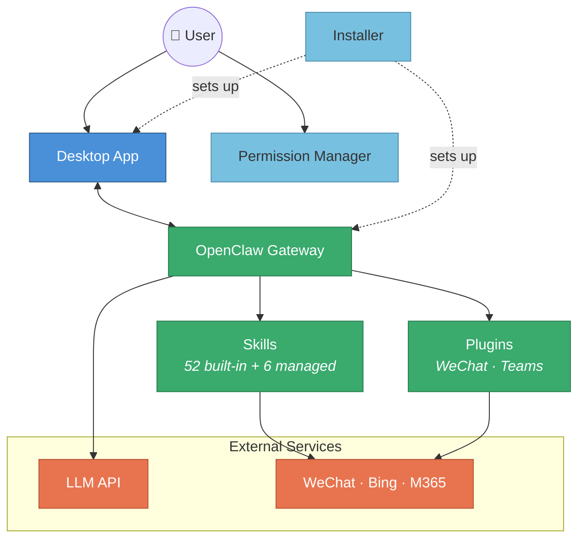

# 🦞 MicroClaw

[中文版](README.zh-CN.md)

**MicroClaw** makes [OpenClaw](https://github.com/openclaw) instantly available on Windows through a familiar, low-friction install experience. It packages the desktop client, local Gateway, managed runtime, preloaded skills, and permission-controlled sandbox into one product so users can get to real tasks quickly. You bring the LLM connection; MicroClaw brings the Windows app, local runtime, and trust boundary.

> [!WARNING]
> **AI & Security Notice**
> MicroClaw is an experimental open-source project initiated by Microsoft that provides a secure execution environment and user interface for the open-source [OpenClaw](https://github.com/openclaw) software that users have installed on their devices. MicroClaw is **not** an AI service, it doesn't contain an AI model, nor does it generate or alter user prompts, responses, or any AI-generated contents on behalf of users.
>
> All AI tasks including inferencing and content generation are solely performed by OpenClaw software with the AI model of your choice, accessed via your own API key and credentials. AI-generated content may be incorrect, AI is not a human, and it has no personality. The sandbox restricts what OpenClaw can access but does not prevent OpenClaw or the LLM from performing actions within the permissions you have granted. You are responsible for reviewing all prompts before submission and for not running prompts from untrusted sources.
>
> 📄 See [DISCLAIMER.md](DISCLAIMER.md) for the full disclaimer, including prompt injection risks, sandbox scope, and limitation of liability.

## Why MicroClaw

MicroClaw is designed to remove the usual Windows setup friction around OpenClaw. Instead of asking users to assemble Node.js, OpenClaw, local configuration, skills, and sandboxing by hand, it installs and wires those pieces together in a single flow.

### Instant Availability

- **Familiar Windows install flow**: packaged installer with desktop shortcut, Start menu entry, and one-click uninstall
- **One run sets up the runtime**: Git, managed Node.js, OpenClaw Gateway, the MicroClaw desktop app, managed skills, and AppContainer provisioning
- **Ready after install**: launch the app immediately after setup instead of building a local OpenClaw environment by hand

### Ready-to-Use Experience

- **Only the LLM is bring-your-own**: the user supplies the model endpoint, API key, and model name; the rest of the stack is installed and configured by MicroClaw
- **Fast path on first launch**: if no provider is configured, the app opens a setup wizard that asks only for model credentials; if `MODEL_*` values already exist in `.env`, MicroClaw can auto-configure them
- **Recommended tasks on day one**: the home screen ships with starter task cards and prompt suggestions so users can begin with concrete tasks instead of a blank chat box
- **Preloaded capability surface**: 52 bundled skills plus 6 managed skills are available as part of the default Windows experience

### Built-In Trust

- **Transparent, permission-controlled actions**: file and tool access requests are surfaced to the user instead of being silently granted
- **Sandboxed with Windows AppContainer**: tool execution runs inside an OS-enforced AppContainer boundary on supported systems
- **Hooks plus sandbox, defense in depth**: hook-based prechecks improve UX while AppContainer ACL enforcement remains the actual security boundary
- **Hard blocks for sensitive paths**: credential-heavy locations such as `.ssh` and cloud config folders are denied rather than merely warned about

---

## Architecture



### Key Interactions

| Path | Protocol | Description |
|---|---|---|
| Renderer ↔ Main Process | Electron IPC | `namespace:action` pattern (e.g. `chat:send-message`, `gateway:restart`) |
| Main Process ↔ Gateway | WebSocket JSON-RPC | Port 18789 loopback, Ed25519 device auth, streaming chat events |
| Main Process → Gateway | HTTP | `/health` polled every 10s; process spawn with auto-restart |
| Gateway → LLM | HTTPS | Streaming API calls to Claude / OpenAI / Gemini |
| Gateway → Skills | In-process | Agent loop invokes tool calls; results fed back to LLM |
| WeChat Plugin → WeChat | HTTPS | Long-poll `getUpdates` + `sendMessage` |
| Permission Manager → AppContainer | Win32 API | AppContainer security capabilities + Job Object resource limits |

---

## Components

| Component | Path | Stack | Description |
|---|---|---|---|
| **Desktop App** | `desktop/` | Electron 33 + TypeScript + Vue 3 + Element Plus | Chat UI, Gateway lifecycle management, system tray |
| **AppContainer Sandbox** | `appcontainer/` | .NET 9 + Node.js preload hooks | Windows AppContainer launcher + permission hooks for tool isolation |
| **Installer** | `deploy.py` + `deployer/` | Python 3 + Tkinter | Wizard-style graphical installer (can be packaged as a single exe) |
| **Skill Packs** | `skills/` | Markdown + JSON + Python/Node | Office, search, browser automation managed skills |
| **WeChat Plugin** | `plugins/openclaw-weixin/` | TypeScript + OpenClaw Plugin SDK | WeChat channel integration |

---

## Quick Start

MicroClaw targets **Windows 10/11**. For most users, the only thing you need to bring is an LLM endpoint and API key.

### 1. Install

> **Note on releases:** The MicroClaw GitHub release page does not ship a pre-built installer binary. Users build the installer from source themselves using the steps below. This is intentional — see the [Releases](#releases) section.

Build the installer from source, then run it:

> **Build prerequisites** (only needed to run `build.ps1`): **Node.js 22+** and **Python 3.10+**. Install the Python build dependencies with `pip install -r requirements.txt` (this includes PyInstaller, used to package the installer exe). End users running the packaged `MicroClawInstaller.exe` do **not** need Python.

```powershell
.\build.ps1                                        # produces dist/MicroClawInstaller/MicroClawInstaller.exe
.\dist\MicroClawInstaller\MicroClawInstaller.exe   # run the installer wizard
```

The installer handles the Windows-side setup in a single run:

- Git for Windows (PortableGit → `~/.openclaw-git`)
- Node.js 22+ via the official signed `.msi` (per-machine install to `%ProgramFiles%\nodejs\`, UAC-elevated; an existing system Node ≥22.16 at that path is reused as-is)
- OpenClaw Gateway (`npm install -g openclaw`)
- Configures the npm registry mirror and V8 compile cache
- Installs the MicroClaw desktop client, managed skills, AppContainer sandbox, WeChat plugin
- Adds Windows Defender exclusions, creates desktop shortcuts (including one-click Uninstall)

After install, launch **MicroClaw** from the Start menu or the desktop shortcut. The desktop app auto-starts the Gateway.

### 2. Add your model credentials

On first launch, the desktop app opens a SetupWizard only when model configuration is missing. The required user input is your model connection:

- Base URL
- API Key
- Model name

You can add or edit models any time under **Settings → Models**. Credentials are stored locally by the desktop app. If `.env` already contains `MODEL_BASE_URL`, `MODEL_API_KEY`, and `MODEL_NAME`, MicroClaw can prefill or auto-apply that configuration.

### 3. Start working immediately

The default home screen is not empty. It ships with starter task cards such as daily news, desktop organization, and travel help, plus prompt suggestions for common work. The bundled and managed skills are already installed, so optional service-specific credentials can be added later only when a particular workflow needs them.

---

## Uninstall

**One-click uninstall** — double-click the **Uninstall MicroClaw** shortcut on your desktop (or run `MicroClawInstaller.exe --uninstall`). This removes the desktop app, skills, sandbox config, shortcuts, and the Node.js / Git / OpenClaw dependencies that the installer set up.

---

## Desktop App

The Electron desktop app is the primary user interface:

- **Chat Interface**: Built with Vue 3 + Element Plus, supports multiple sessions
- **Gateway Management**: Automatically starts/restarts the local OpenClaw Gateway
- **WebSocket Communication**: JSON RPC protocol with Ed25519 device authentication
- **Skill Integrity Detection**: SHA-256 checksums on all skill files at startup, Ed25519 signature verification
- **System Tray**: Runs in the background with status indicators

Development mode:

```bash
cd desktop
npm install
npm run dev
```

### Linting

ESLint is configured for both the main process and renderer. **Run lint before committing** to avoid CI failures:

```bash
# Desktop main process
cd desktop
npm run lint

# Renderer (Vue 3)
cd desktop/renderer
npm run lint
```

To generate SARIF output for CI integration:

```bash
npm run lint:sarif    # outputs eslint-results.sarif
```

---

## Sandbox Isolation

`appcontainer/` provides a Windows AppContainer-based sandbox for isolating tool execution:

- **.NET launcher** (`AppContainerLauncher.exe`) runs child processes inside an AppContainer with restricted ACLs
- **Node.js preload hooks** (`sandbox-preload.js`, `sandbox-fs-hooks.js`, …) intercept `fs.*` / `child_process.*` calls and prompt the user for permission
- **Sensitive-path shield** hard-denies access to `~/.ssh`, `~/.azure`, and other credential directories — no override

See [appcontainer/README.md](appcontainer/README.md) for details.

---

## Skill System

### Built-in Skills (52)

Installed alongside OpenClaw and controlled via the `skills.allowBundled` allowlist. Categories include:

| Category | Example Skills |
|---|---|
| Productivity | obsidian, notion, trello, slack, discord, things-mac |
| AI / Coding | coding-agent, gh-issues, oracle, skill-creator |
| Communication | bluebubbles, wacli, voice-call |
| Smart Home | openhue, blucli, sonoscli, eightctl |
| Media | spotify-player, songsee, video-frames |
| Utilities | weather, healthcheck, session-logs |
| Voice | openai-whisper, sherpa-onnx-tts, sag |

### Managed Skills (6)

Installed to `~/.openclaw/skills/`, these are custom advanced skills included in this project:

| Skill | Description |
|---|---|
| excel-xlsx | Create and edit Excel workbooks |
| powerpoint-pptx | Create and edit PowerPoint presentations |
| word-docx | Create and edit Word documents |
| officecli | Office document CLI tool (create/edit .docx/.xlsx/.pptx) |
| desktop-organizer | Scan and organize files on the Windows desktop |
| security-practice | AI agent safety practices (red/yellow line rules, install audit protocol) |

---

## WeChat Plugin

`plugins/openclaw-weixin/` — Connects OpenClaw to WeChat:

- QR code login, no username/password needed
- Multi-account + sender isolation
- Supports text, image, video, and file messages
- Long-polling message updates

---

## Security Features

| Mechanism | Description |
|---|---|
| **Skill Integrity Checks** | SHA-256 hashes + Ed25519 signatures — detects tampering of all skill files at startup |
| **Device Authentication** | Each device generates an Ed25519 key pair; Gateway connections are signature-authenticated |
| **Skill Allowlist** | `allowBundled` / `allowManaged` control the available skill scope |
| **Sandbox Isolation** | OS-native AppContainer + Job Object isolation for file system, network, and resource limits |
| **Local Gateway** | Binds to loopback only — does not accept remote connections |

---

## Build

Full build pipeline (PowerShell):

```powershell
.\build.ps1
```

This script sequentially:

1. Builds the desktop app (`desktop/` → Electron Builder)
2. Creates portable zip package (`dist/microclaw-portable.zip`)
3. Packages the installer exe (PyInstaller → `dist/MicroClawInstaller.exe`)

### MSIX package

The CI and release workflows also build `desktop/release/MicroClawDesktop-<version>-x64.msix`
with Electron Builder. The package includes the Electron app, the pinned OpenClaw
runtime, Node.js, and the AppContainer launcher resources. On first launch, the
read-only bundled runtime archive is expanded under Electron's per-user
`userData` directory; configuration and other writable state remain in per-user
application data.

Build and validate it locally on Windows:

```powershell
npm ci --prefix desktop
npm run dist:msix --prefix desktop
$msix = Get-ChildItem .\desktop\release\MicroClawDesktop-*-x64.msix | Select-Object -First 1
.\scripts\windows\validate-msix.ps1 -Path $msix.FullName
```

Without configuration, the build uses a non-production `MicroClaw.Test` identity
for CI validation. Before Partner Center submission, configure
`MSIX_IDENTITY_NAME`, `MSIX_PUBLISHER`, `MSIX_PUBLISHER_DISPLAY_NAME`, and
`MSIX_APPLICATION_ID` from the reserved app identity. The publisher must exactly
match Partner Center (and the subject of any sideloading certificate). Store
submissions may remain unsigned because Microsoft signs accepted packages;
sideloaded packages must be signed with a trusted certificate after packaging.
The Partner Center identity values should be stored as GitHub Actions secrets,
not committed. Tagged workflows derive the MSIX version from the `vX.Y.Z` tag
and only attach the MSIX to the GitHub Release when all four production identity
secrets are configured; validation-identity packages remain Actions artifacts.
Store/MSIX installs use package-managed updates rather than the EXE
download-update path.

### Prerequisites

- Node.js 22+
- Python 3.10+ — install build deps with `pip install -r requirements.txt` (includes PyInstaller)
- .NET 9 SDK (for the AppContainer launcher)
- .NET 10 SDK (for the bundled Windows Node host)
- npm dependencies installed (`cd desktop && npm install`)

---

## Project Structure

Operational Windows scripts now live under `scripts/windows/`. Root `.bat` and `.ps1` files are retained as compatibility wrappers so existing commands keep working.

```
├── deploy.py                    # Stable installer entry point (Tkinter GUI)
├── deployer/
│   ├── config.py                # Configuration management (.env + YAML)
│   ├── logger.py                # Thread-safe logger + in-memory ring buffer
│   ├── skill_catalog.py         # 52 built-in + 6 managed skill catalog
│   ├── skill_manager_ui.py      # Skill selector dialog
│   └── windows_setup.py         # Windows install logic (Node/npm/OpenClaw)
├── desktop/                     # Electron desktop app
│   ├── src/                     # Main process (TypeScript)
│   └── renderer/                # Vue 3 renderer process
├── appcontainer/                # Windows AppContainer sandbox (.NET + preload hooks)
├── skills/                      # Managed skill definitions
├── plugins/openclaw-weixin/     # WeChat channel plugin
├── scripts/
│   ├── windows/                 # Canonical Windows helper scripts
│   └── generate-skill-snapshot.js
├── docs/
│   ├── architecture/            # Repo structure and architectural decisions
│   ├── plans/                   # Planning docs
│   └── reference/               # Design and setup reference material
├── build.ps1                    # One-click build script
├── launch.bat                   # Compatibility wrapper -> scripts/windows/launch.bat
├── setup.bat                    # Compatibility wrapper -> scripts/windows/setup.bat
├── setup-dependencies.ps1       # Compatibility wrapper -> scripts/windows/setup-dependencies.ps1
├── uninstall.bat                # Compatibility wrapper -> scripts/windows/uninstall.bat
├── uninstall-dependencies.ps1   # Compatibility wrapper -> scripts/windows/uninstall-dependencies.ps1
├── start-gateway.cmd            # Manual Gateway start
├── MicroClawDeployer.spec       # PyInstaller packaging config
└── requirements.txt             # Python dependencies
```

See [docs/architecture/repository-layout.md](docs/architecture/repository-layout.md) for the structural rules and the long-term migration target.

## Configuration

Most users can do everything from **Settings** inside the desktop app — models, Brave API key, skill allowlist, etc. Runtime settings live in `~/.openclaw/openclaw.json`; you can hand-edit it if needed.

Fresh installs include the official Parallel web-search plugin and select its keyless
`parallel-free` provider, so web search works without additional setup. Usable existing web-search
provider choices are preserved during upgrades; Brave or Tavily without an API key falls back to
Parallel. The provider can be changed later in **Settings**.

For developers / unattended installs, the installer also accepts a `.env` file (`MODEL_BASE_URL`, `MODEL_API_KEY`, `MODEL_NAME`, `MODEL_API_FORMAT`, `MODEL_REASONING_EFFORT`, `BRAVE_API_KEY`) — see [.env.example](.env.example). `python deploy.py` reads `.env` from the repo root; the packaged `MicroClawInstaller.exe` reads `.env` from next to the exe.

## System Requirements

- Windows 10/11
- Python 3.10+ (only required to run the installer)
- Network connection (mainland China mirror support included)
- Optional: Microsoft Edge (browser skills)

## Releases

The MicroClaw GitHub release page is intentionally **source-only**: it does **not** publish prebuilt installer binaries (`MicroClawInstaller.exe`, portable zips, or any other packaged artifacts). Users obtain MicroClaw by cloning this repository and running `build.ps1` themselves. This keeps the distribution channel transparent and auditable — you only ever run binaries you produced from source you can inspect.

If you fork this project, please honor the same policy unless you intend to take on responsibility for code signing, malware scanning, and supply-chain attestation of any binaries you publish.

## Contributing

This project welcomes contributions and suggestions. Most contributions require you to agree to a
Contributor License Agreement (CLA) declaring that you have the right to, and actually do, grant us
the rights to use your contribution. For details, visit https://cla.opensource.microsoft.com.

When you submit a pull request, a CLA bot will automatically determine whether you need to provide
a CLA and decorate the PR appropriately (e.g., status check, comment). Simply follow the
instructions provided by the bot. You will only need to do this once across all repos using our CLA.

This project has adopted the [Microsoft Open Source Code of Conduct](https://opensource.microsoft.com/codeofconduct/).
For more information see the [Code of Conduct FAQ](https://opensource.microsoft.com/codeofconduct/faq/) or
contact [opencode@microsoft.com](mailto:opencode@microsoft.com) with any additional questions or comments.

See [CONTRIBUTING.md](CONTRIBUTING.md) for detailed contribution guidelines.

## Security

Please see [SECURITY.md](SECURITY.md) for information on reporting security vulnerabilities.

## License

MIT — see [LICENSE](LICENSE) for the full license text.
